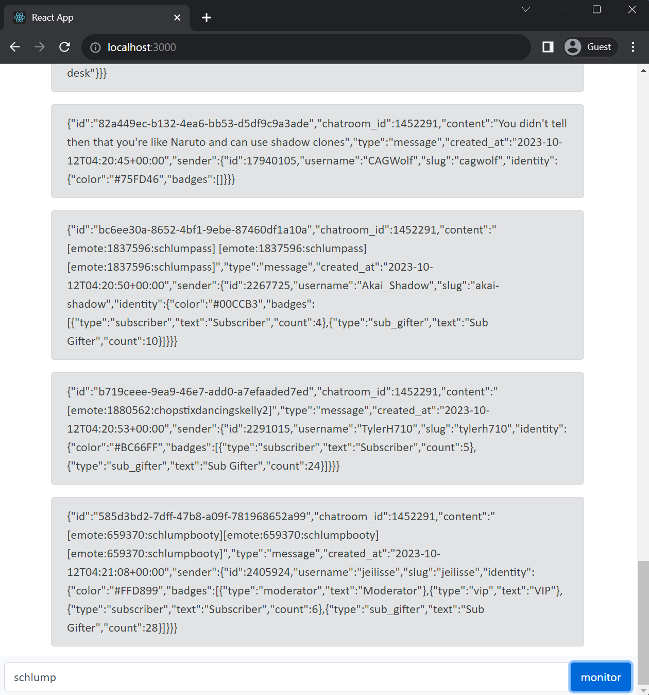

# kick.com Adapter

This project initiates a scraper for kick.com, which can monitor new chat messages on any channel.

The project has 2 modules: server and client.

-   The `messages-core` server has an SSE endpoint which returns all chat updates in real-time.
-   The `messages-client` provides a UI for subscribing and tracking chat updates.

Demo: [http://messages.myfunc.io:3000/](http://messages.myfunc.io:3000/)



## Running Instructions

There are two ways to run:

### 1. Locally

To start the server from the `/services/core` directory, run:

```
npm install
npm run start
```

To start the client from the `/services/client` directory, run:

```
npm install
npm run start
```

The server will be accessible at `localhost:3000`.

### 2. Using Docker

Navigate to the `/services` directory and execute:

```
docker-compose up
```

The server will be accessible at `localhost:3000`.
